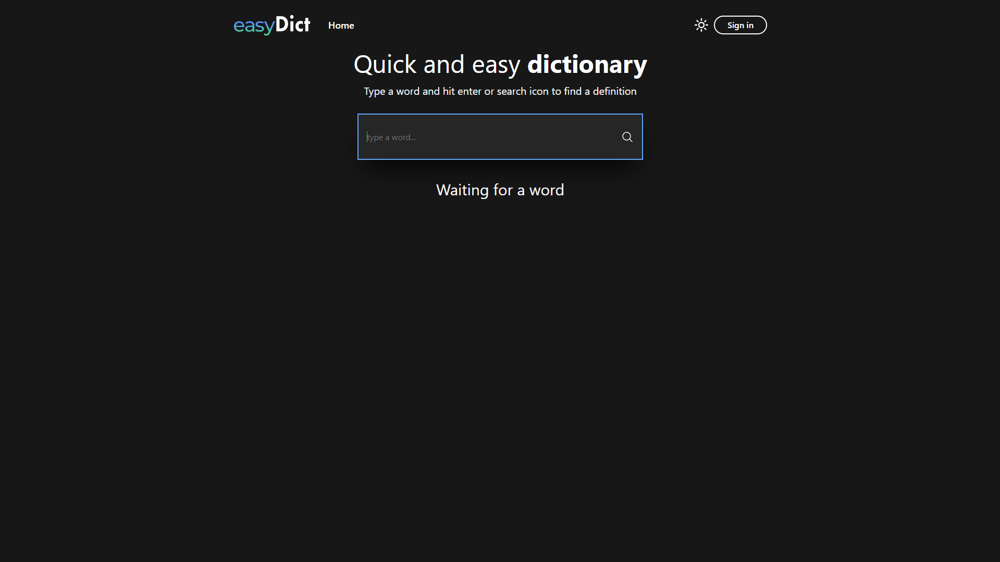

# [EasyDict](https://t3-easydict-fullstack.vercel.app/)

[](https://t3-easydict-fullstack.vercel.app/)


## Description

In this App I wanted to test out a popular tech stack T3, which is based on TypeScript and includes Next.js with Page Routes, tRCP, Prisma, NextAuth and Tailwind. The  EasyDict App uses the public free dictionary api to, to get the definitions of different  words. For the database, I used PlanetScale which is based on MySQL. The authentication is based on NextAuth and the GitHub provider. The searched definitions can be easily copied into a clipboard by clicking on a box that the definition is wrapped in. Users have the ability to view their history of searched words and to delete unwanted words. Users can listen to the pronunciation of different words. In that case the speaker icon will be displayed, otherwise, if the sound is not available, the speaker icon will be hidden. The app has a built-in pop up that shows up on a word search and lets the user know if the search has succeeded or failed. The App is responsive with minimalistic design and includes a dark mode switch. 

This simple app has allowed me to learn full stack app development with the t3 stack. There are a lot of things that I liked in this stack and a lot of things that I don't. There are also a lot of things that can be improved in my app but due to the latest releases of next.js and app router I prefer to focus on that rather than on next.js with pages app.    


## Tech Stack

- [Next.js](https://nextjs.org)
- [Tailwind CSS](https://tailwindcss.com)
- [Zustand](https://zustand-demo.pmnd.rs/)
- [Headlessui](https://headlessui.com/)
- [tRCP](https://trpc.io/)
- [Prisma](https://www.prisma.io/)
- [NextAuth](https://next-auth.js.org/)
- [PlanetScale](https://planetscale.com/)

## Installation

### 1. Clone the repository

```bash
git clone https://github.com/ilisiecki/t3-easydict-fullstack.git
```

### 2. Install dependencies

```bash
npm install
```

### 3. Create a `.env` file

Create a `.env` file in the root directory and add the environment variables as shown in the `.env.example` file.

### 4. Push database

```bash
npx prisma db push
```

### 5. Run the application

```bash
npm run dev
```

### 6. View the application

Open [http://localhost:3000](http://localhost:3000) with your browser to see the result.


## Deploy on Vercel

The easiest way to deploy your Next.js app is to use the [Vercel Platform](https://vercel.com/new?utm_medium=default-template&filter=next.js&utm_source=create-next-app&utm_campaign=create-next-app-readme) from the creators of Next.js.

Check out our [Next.js deployment documentation](https://nextjs.org/docs/deployment) for more details.
